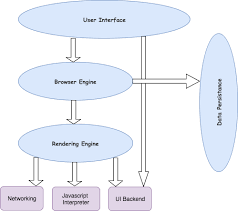
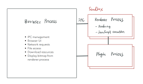

## FAQ
Q1. When a user enters an URL in the browser, how does the browser fetch the desiredresult ? Explain this with the below in mind and Demonstrate this by drawing a diagramfor the same.
 the process involves the browser, your computer’s operating system, your internet service provider, the server where you host the site,
 and services running on that server.
	
	steps your browser takes to:

     # you type the url in the browser.
     # browser fetches the ip address of the domain name. 
     # browser establishes a connection with the server.
     # browser sends a request.
     # server responds with the files or say data.
     # browser renders the content.
    
a.
A web browser takes you anywhere on the internet. It retrieves information from other parts of the web and displays it on your desktop or mobile device. The information is transferred using the Hypertext Transfer Protocol, which defines how text, images 
and video are transmitted on the web.
  

b.
Components of a Web Browser
1. User Interface
It is an environment allowing users to use certain features like search bar, refresh button, menu, bookmarks, etc.

2. Browser Engine
The bridge connects the interface and the engine. It monitors the rendition engine while manipulating the inputs coming from multiple user interfaces.

3. Networking
The protocol provides an URL and manages all sorts of safety, privacy and communication.
In addition, the store network traffic gets saved in retrieved documents.

4. Data Storage
The cookies store information as the data store is an uniform layer that the browsers use. Storage processes like WebSQL, localStorage etc works well on browsers.

5. JavaScript Interpreter
It allows conversion of JavaScript code in a document and the executes it. Then the engine shows the translation on the screen to the users.

c.
process used in web development that turns website code into the interactive pages users see when they visit a website. The term generally refers to the use of HTML,
CSS, and JavaScript codes. The process is completed by a rendering engine, the software used by a web browser to render a web page.

d.
converting a program into an internal format that a runtime environment can actually run, for example the JavaScript engine inside browsers. 
The HTML parser is a structured markup processing tool. It defines a class called HTMLParser, ​which is used to parse HTML files. It comes in handy for web crawling​.

e.
he script processor executes Javascript code to process an event,
allows you to specify your own processor logic for a simple processor using JavaScript

f.
The input to the tree construction stage is a sequence of tokens from the tokenization stage. The tree construction stage is associated with a DOM Document object when a
 parser is created. The "output" of this stage consists of dynamically modifying or extending that document's DOM tree.

g.
In order to assess the consequences of any such decision, it helps to understand how browsers work: When the browser processes an HTML document, it does so from top to bottom.
Upon encountering a <script> tag, it halts (“blocks”) further processing in order to download the referenced script file.
 
